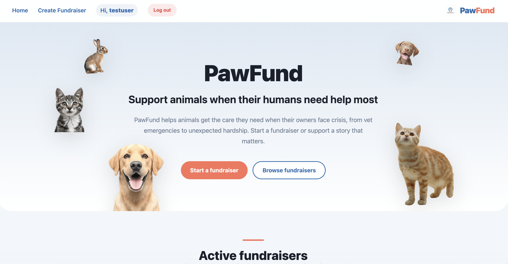
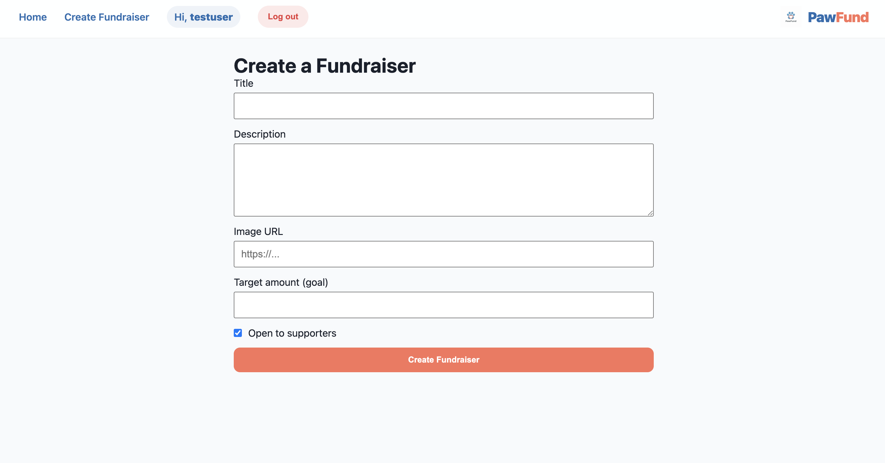
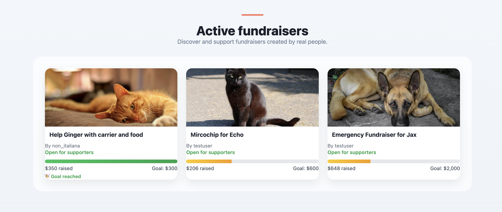
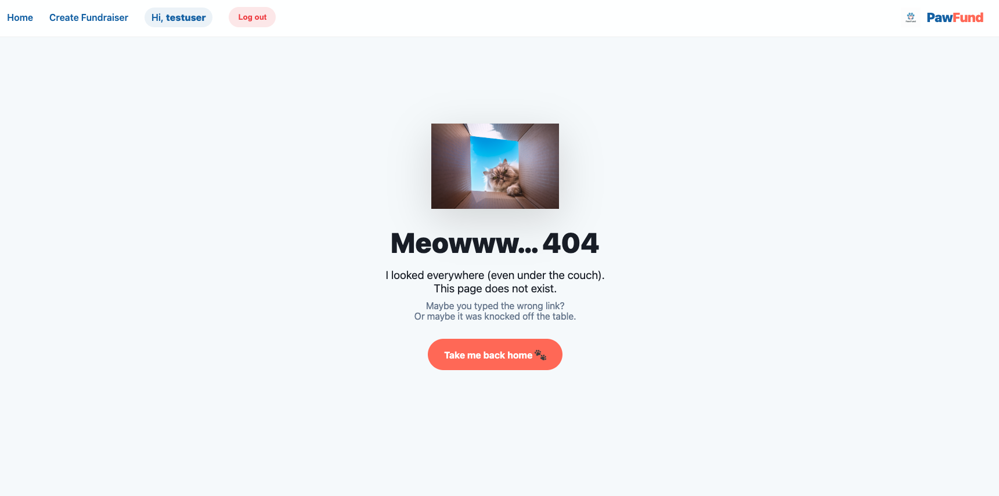

# 🐾 **PawFund**

**PawFund is a crowdfunding platform designed to help animals receive urgent care when their owners are facing crisis.**
**Users can create fundraisers, pledge support, and track progress toward funding goals.**

# 🌍 Live Project

## Frontend:
👉 https://your-frontend-url.com

## Backend API:
👉 https://shecodes-production-app-a88e0902e533.herokuapp.com/

## 🎯 Target Audience

PawFund is designed for:

- Pet owners facing financial hardship

- Animal rescue organisations

- Supporters who want to help animals in need

## 🚀 Features

### 👤 User Accounts

- Register

- Log in

- Token-based authentication

- Owner-only edit/delete permissions

## 📢 Fundraisers

### Each fundraiser includes:

- Title

- Owner

- Description

- Image

- Target amount

- Open / Closed status

- Date created

- Total pledged tracker

## 💸 Pledges

### Each pledge includes:

- Amount

- Supporter

- Anonymous option

- Optional comment

## 🔐 Permissions

- Only the owner can edit/delete a fundraiser

- Only authenticated users can create fundraisers

- Only authenticated users can pledge

## 🎨 UI / UX

- Responsive design

- Hero section with animated CTA

- Progress bar tracker

- Mobile hamburger menu

- Custom 404 page 

## 🛠️ Tech Stack

### Frontend:

- React

- React Router

- Vite

- CSS (custom styling)

### Backend:

- Django

- Django Rest Framework

- Token Authentication

- Heroku deployment

## 📸 Screenshots

### 🏠 Homepage

### ➕ Fundraiser Creation Page

### 📝 Fundraiser Creation Form

### 💬 Fundraiser with Pledges

### Custom 404 Page

### Fundraiser Page View for Unregistered User 

